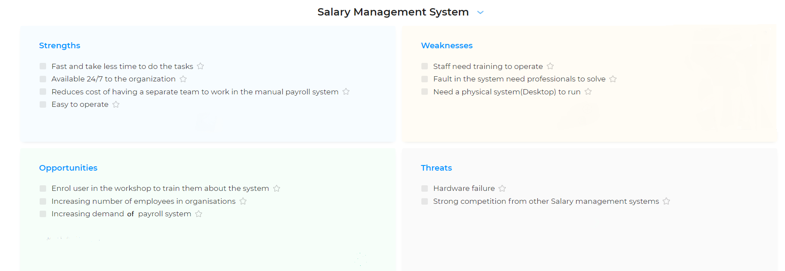

# Requirements

## Introduction

The aim of this project is to automate the salary system of an organisation. The Salary Management System helps streamline and centralize the salary payments of the organisation. It helps an organisation to manage the salary of the employees. The software calculate salary, incentives, bonus and tax deduction etc by itself. Manager can add the details of an employee like name, address department etc. and can see salary breakdown of every employee. This project will significantly cut down the processing time and cost of hiring a seperate person to handle salary related tasks.

## Research

### Problem Identification

The organisation using manual system to manage salaries have to calculate salaries and tax deduction af the employee.  The manual work required a lot of paper work and handle several type of files manually. They have to keep record of tax of whole organization. All this paperwork is extremly time consuming job, and accordingly costly as well as they have to hire more man power to the job in time.

There is always a risk of human error in the manual work, which will eventually halt or slow down the productivity of whole organisation. And if there is a delay in payment of salaries of any employee then this affect the relationship of organisation and the employee. Therefore organisation require a software that can handle all of the work without making any error and reduce the time and cost of managing the salry.

## Benefits

* Saves times and efforts that go into building a plan, acquiring and compiling all employee data, and manually setting up the entire system.
* Doesn’t hamper productivity of those employees who would have otherwise spent time in dealing with paper work.
* Company resources are saved; implementing it manually is very costly.
* Mistakes in manually managing the salaries can lead to fines and penalties. Thus salary management system help in reducing unwanted costs.
* The user need not be an expert in any domain as all the calculation is done by the software. User just have to use the software to do the task without worrying about the working of the software.
* Timely delivery of the salaries and taxes. Oranization could deliver the salarries and taxes in time thus maintaining a healthy relationship between organization and its employees.

# SWOT Analysis

